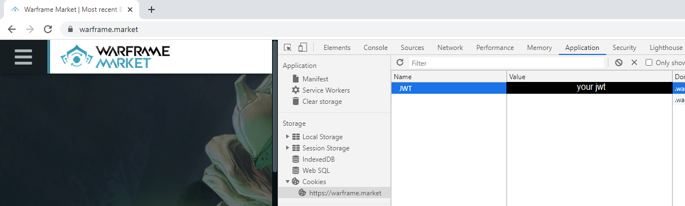

# README
* [What is this project?](##what-is-this-project?)
* [Important Disclaimer](##important-disclaimer)
* [What does the program do?](##what-does-the-program-do?)
  * [The trading style that makes it useful](###the-trading-style-that-makes-it-useful)
  * [The problem with that style](###the-problem-with-that-style)
  * [A lacking solution](###a-lacking-solution)
  * [A better solution](###a-better-solution)
* [How to use the program](##how-to-use-the-program)
  * [Setting up first time](###setting-up-first-time)
  * [Workflow](###workflow)

## What is this project?

This project contains a small desktop console application written in Java.
Its purpose is to offer an additional, but very specific, option for managing a user profile on [Warframe.market](https://warframe.market/)

## Important Disclaimer

The program in this project uses a JSON Web Token (JWT) specific to your Warframe.market user account for certain actions.  
This JWT simply is a long sequence of characters and enables anyone in possession of it to manage your Warframe.market user account.  
For that reason it is very important that this JWT doesn't get in the wrong hands, so don't share it lightly.  
I will NOT receive ANY of your info (such as your JWT) if you download and run my program. That info will ONLY be stored locally on the device that you run my program on and it will ONLY be used for making requests to Warframe.market.

## What does the program do?

I mainly wrote this program for myself in order to make my use of Warframe.market as a trader easier.  
It caters to traders who offer a lot of items that can be acquired from Syndicates for sale and who have a specific trading style.  
  
### The trading style that makes it useful

The trader acquires the Syndicate items that they intend to sell on demand; that means that they usually don't own the items that they
offer for sale yet and only retrieve them from a Syndicate when another trader specifically asks for them.  
The purpose of this trade style is to keep a broad range of offers, in order to increase sale rates, while not having to stockpile items for all your offers, since the items tend to varry greatly in demand.  
Essentially, the trader only spends precious Syndicate standing when there is a current request for a specific item.  

### The problem with that style

So, what happens when a trader runs out of standing for a Syndicate, thus rendering them unable to acquire more Syndicate items for their trading customers? They can't keep their offers on Warframe.market up or else people will keep contacting them, only to be disappointed by a "Sorry, I don't have anything to sell to you right now". But completely deleting the offers from their profile, only to re-add them later once they stocked up on Syndicate standing again, sounds like a very time-consuming and annoying process.  

### A lacking solution

The trader sets their affected orders to be invisible to other users. Better than the previous solution, but they still have to selectively click the "Visible" button for each order. Even worse if they can't tell from memory which items can be acquired from which Syndicates, thus wasting even more time when looking up this information.  

### A better solution

It's this program. It let's you specify with a few simple commands which Syndicates you ran out of standing for, by setting them to 'invisible', and then leave it to the program to automatically identify all affected sell orders from your Warframe.market profile and set them to be invisible on the site. Of course that also works in the other direction, making Syndicates and sell orders on your profile visible again.  

## How to use the program

If you know what you're doing you can just download the code from this repository and compile+run it yourself.  
A more comfortable solution would be to download the latest release of my program, which is an executable JAR file.  
In any case you need to have Java installed on your device.  
To start the program, open the command line (under Windows it can be found by typing "cmd" in your search bar) and type the following command:
`java -jar /path_to_jar_file/WarframeMarketOrderManager.jar`  
Can't make it much easier for you right now.

Once the program has started, type `help` to get a full list of available commands.
I also urge you to use the built-in `exit`command if you want to exit the program, so that it can properly save configuration data for the next start.

### Setting up first time

If you are running the program for the first time, you need to provide it with some info regarding your Warframe.market profile, so that it is actually able to perform its tasks. Before you give it your info, make sure you have read [the disclaimer](##important-disclaimer).  
The program needs the following info from you:
* ``username`` - This is the username of your Warframe.market profile. Specifically, it needs to be the one displayed in the URL of your profile; from ``warframe.market/profile/<your_user_name>``, use the ``<your_user_name>`` component (without <>, of course).  
This is required so that the program knows which Warframe.market profile it has to manage.
* ``jwt`` - This is the JSON Web Token that enables the program to perform actions on your Warframe.market account that only an authenticated user is allowed to. To get your JWT, open Warframe.market in your browser and ensure that you are logged in with the user account that you want the program to manage. It will be stored in the Cookie for warframe.market with the name "JWT".  
Below you can see an example for how to find that Cookie in Chrome. While on the Warframe.market website, open Chrome's developer window ([F12] key), navigate to the 'Application' tab at the top and select 'https://warframe.market' from the Cookies in the left sidebar. A table should then open, containing columns for 'Name' and 'Value', among othert things. My program needs the text from the 'Value' field within the row with the name 'JWT'; you can just copy and paste it into the console when setting the JWT.

Note that the JWT used by the program may expire, for instance if it hasn't been refreshed for 60 days, and you will have to acquire a new one to provide to the program.

### Workflow

Start by setting the visibility for Syndicates. If you set a Syndicate as 'visible', then that means that you have standing for that Syndicate and can acquire items from it to sell them. If you set it to 'invisible', that means you can not or do not want to sell items from this Syndicate right now. Based on these visiblity settings, the program determines which of your sell orders on Warframe.market should be visible or invisible to other users of the website.
Since many items can be acquired from multiple different Syndicates, the following logic applies for the decision making of the program:
* If all Syndicates, from which the item can be acquired, are set as 'invisible', then the item's sell order on your profile will be set invisible.
* If one ore more of the Syndicates, from which the item can be acquired, are set as 'visible', then the item's sell order on your profile will be set visible.
To update your orders on Warframe.market based on your Syndicate visibility settings, use the `update` command.
